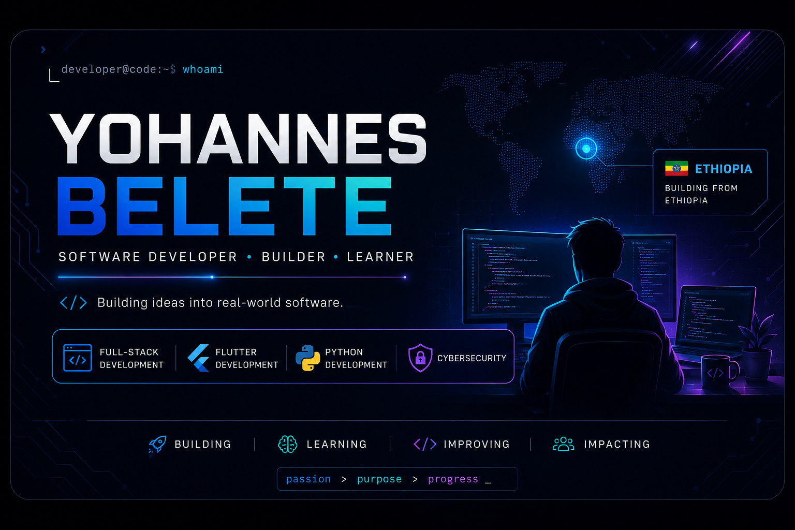

  

<h1 align="center">Hi 👋, I'm Yohannes Belete</h1>

<h3 align="center">
Computer Science Student  • Full-Stack Development • Flutter • Cybersecurity 
</h3>

  I build secure, useful, and beautiful digital products.

  ## 🚀 About Me

I'm a Computer Science student passionate about software development, cybersecurity, and technology.

I enjoy turning ideas into real-world products — from web applications and mobile apps to secure digital systems.

### 🔭 Currently working on
- 🚗 ShumShufer — an Ethiopian driving-lesson marketplace
- 🌐 Full-stack web development
- 📱 Flutter & Dart application development
- 🔐 Cybersecurity and IT support

### 🌱 Currently learning
- JavaScript
- Flutter & Dart
- Backend development
- Databases & APIs
- Cybersecurity

### 🎯 My goal
To become a highly skilled software engineer and build technology that solves real problems.

## 🛠️ Tech Stack

### 💻 Languages

  

### 🌐 Web & Backend

  

### 📱 Mobile

  

### 🗄️ Databases & Tools

  

### 🔐 Cybersecurity

  

## 🚀 Featured Projects

### 🚗 ShumShufer
Ethiopian Driving Lesson Marketplace

A platform connecting learners with verified driving schools and instructors.

- 🏫 Driving school discovery & comparison
- 📚 Learning Management System (LMS)
- 📅 Driving lesson booking
- 💳 Online payments
- 🔐 Verification & trust system
- 📱 Web & mobile application

Tech: Next.js Node.js Express Flutter SQLite Tailwind CSS

---

### 🌦️ Weather Web App
Weather & Outfit Recommendation Application

A responsive weather application that provides weather information together with practical outfit recommendations.
## 📊 GitHub Stats

  
  

  

Tech: Flutter Dart API Integration

---

### 💼 Developer Portfolio
Personal Portfolio Website

A responsive portfolio showcasing my projects, technical skills, experience, and development journey.

Tech: HTML CSS JavaScript Node.js
🌐 Connect With Me

  
  

## 🎯 Current Focus

- 🚀 Building and improving ShumShufer
- 💻 Becoming a stronger Full-Stack Developer
- 📱 Developing applications with Flutter & Dart
- 🔐 Expanding my Cybersecurity skills
- 🌐 Building real-world projects and contributing to open source
- 📚 Continuously learning and improving my software engineering skills
  ---

  <b>💡 Building. Learning. Creating.</b>

  Thanks for visiting my profile! 🚀

  <i>Let's build something meaningful.</i>

